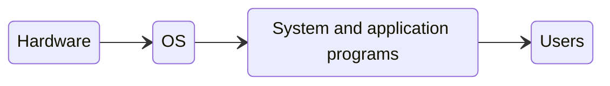

---
# Introduction to Operating Systems

[Back to index](../OS.md)

1. [Definition of an operating system (OS)
2. [Historic evolution](#historic-evolution)
3. [Functional blocks of an operating system](#functional-blocks-of-an-os)
4. [Booting and halting of the system](#booting-and-halting-of-the-system)
5. [Classification of the operating systems](#Classification-of-the-os)

---

## Definition of an OS

### Computing System

Formed by:
- **Hardware**.
- **Software**:
	- Application programs.
	- System programs (OS and other system programs)
- **Users**.

### Definition of an OS

- Controls the execution of the application programs.
- Works as the interface between the user and the hardware.
- Only program permanently executed in the computer (kernel).

### Types of users

- **Applications user:**
	- Uses application programs.

- **Programmer user:**
	- Uses utilities (programming languages, libraries, compilers...)
	- Requires a **system calls library**:
		- Interface between processes and OS.
		- Call OS services that are executed with high privilege.

- **Developer of the OS.**
	- Interacts with the hardware directly.

---
## Historic evolution

### 1 - No OS
- No users.
- An operator manages a console of switchers, indicators, an input device and a printer.
- Programs written in machine code.

### 2 - Batch processing
- Ancestor of the OS.
- Several users give jobs to the operator.
- Similar jobs grouped in batches.
- Uses punched cards with fortran code.
- Monitor slowly reads one card at a time (**mono-programed**).

### 3 - Multi-programed systems
- First OS.
- I/O times are much higher than CPU ones.
- Memory stores several programs besides the OS.
- CPU may switch between tasks when waiting for I/O.
- Processes can monopolize CPU.

### 4 - Time-sharing systems
- OS distributes CPU time between processes.
- Uses also multi-programming.

### 5 - Modern OS
- Uses new technologies:
	- Real-time OS.
	- Multithread.
	- Symmetric multiprocessing.
	- Distributed OS.
	- Object-oriented design.

---
## Functional blocks of an OS

- **Process management**
	- Creation, elimination, suspension and restarting of processes.
	- Synchronization and communication between processes.

- **Main memory management**
	- Keep track of main memory usage and ownership.
	- Allocate and free memory space.

- **I/O management**
	- Manage peripherical devices.

- **Secondary memory management**
	- Manage free space and operations on disk.
	- Manage files creation, removal, manipulation and location on disk.

- **Security and protection**
	- Manages users identity and operations allowance for each one.

- **Networks**
	- Allows communications between different computers.

- **Command prompt**
	- Can be part of the kernel or a specific program.

---
## Booting and halting of the system #TODO

1. Press the ON button.
	- Empty main memory 
2. Uses a booting software (**firmware**).
	- Some predefined data is loaded to the CPU registers.
	- In PCs it is also called BIOS (*Basic Input Output System*)
		- Written and stored by the manufacturer.
	- 
---
## Classification of the OS #TODO

---
