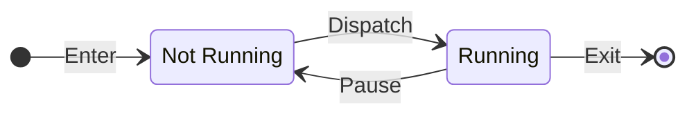
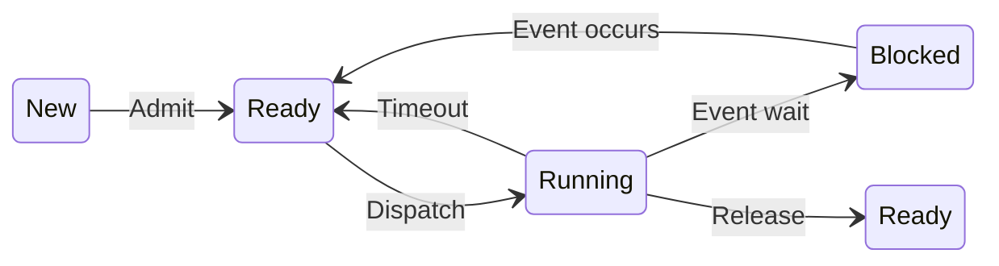

---
# Processes life cycle

[Back to index](../OS.md)

---

## Simple model

```mermaid
stateDiagram
    direction LR
	A1: Not Running
	A2: Running


    [*] -->  A1: Enter
	A1  -->  A2: Dispatch
	A2  -->  A1: Pause
	A2  --> [*]: Exit
    
```
- Do not work for multiprogramming

## 5-state model

```mermaid
stateDiagram
    direction LR
	A1: New
	A2: Ready
	A3: Running
	A4: Blocked
	A5: Ready


    A1 -->  A2: Admit
	A2 --> A3: Dispatch
	A3 --> A2: Timeout
	A3 --> A4: Event wait
	A4 --> A2: Event occurs
	A3 --> A5: Release
    
```
