---
# Processes Control

[Back to index](../OS.md)

---
## Process Typology

```mermaid
gantt
    title CPU intensive
    dateFormat X
    axisFormat %s
    
    exec    : a, 0, 4
    IO      : b, 4, 6
    exec    : a, 6, 8
    IO      : b, 9, 10
    exec    : a, 10, 14
    IO      : b, 14, 15
    exec    : a, 15, 19
```

- More CPU use than I/O.
- Few CPU strikes with long duration.

```mermaid
gantt
    title IO intensive
    dateFormat X
    axisFormat %s
    
    exec    : a, 0, 4
    IO      : b, 4, 5
    exec    : a, 5, 9
    IO      : b, 9, 10
    exec    : a, 10, 14
    IO      : b, 14, 15
    exec    : a, 15, 19
```

- **I/O intensive**
	- More I/O than CPU use.
	- Many CPU strikes with short duration.

---
## Long term scheduler

---
## Mid term scheduler

---
## Process Switching

---
## Process Shutdown

---