---
# Processes Control

[Back to index](../OS.md)

---
## Process Typology

```mermaid
---
displayMode: compact
---
gantt
    title CPU intensive
    dateFormat X
    axisFormat %s
    
    CPU     : a, 0, 4
    IO      : crit, b, 4, 6
    CPU     : a, 6, 10
    IO      : crit, b, 10, 12
    CPU     : a, 12, 16
```

- More CPU use than I/O.
- Few CPU strikes with long duration.

```mermaid
---
displayMode: compact
---
gantt
    title IO intensive
    dateFormat X
    axisFormat %s
    
    CPU     : a, 0, 1
    IO      : crit, b, 1, 3
    CPU     : a, 3, 4
    IO      : crit, b, 4, 6
    CPU     : a, 6, 7
    IO      : crit, b, 7, 9
    CPU     : a, 9, 10
    IO      : crit, b, 10, 12
    CPU     : a, 12, 13
    IO      : crit, b, 13, 15
    CPU     : a, 15, 16
```

- More I/O than CPU use.
- Many CPU strikes with short duration.

---
## Long Term Scheduler (LTS)

- Its function is to admit new jobs in the system (to become processes).
- Transfers from the `new` queue to the `ready` queue.
- It must decide if the OS can accept more processes.
	- Limits the level of multi-programing (number of processes in memory)
- Tries to balance the number of CPU and I/O intensive processes in the STS.
---
## Mid term scheduler (MTS)

---
## Process Switching

---
## Process Shutdown

---