---
# Processes Control

[Back to index](../OS.md)

---
## Process Typology

```mermaid
gantt
    title CPU intensive
    dateFormat X
    axisFormat %s
    
    exec    : a, 0, 4
    IO      : b, 4, 6
    exec    : a, 6, 10
    IO      : b, 10, 12
    exec    : a, 12, 16
    IO      : b, 16, 18
    exec    : a, 18, 22
```


- More CPU use than I/O.
- Few CPU strikes with long duration.

```mermaid
gantt
    title CPU intensive
    dateFormat X
    axisFormat %s
    
    exec    : a1, 0, 1
    IO      : b1, after a1, 3
    exec    : a2, after b1, 4, sameline a1
    IO      : b2, after b1, 6
    exec    : a3, 6, 7
    IO      : b3, 7, 9
    exec    : a4, 9, 10
```

- **I/O intensive**
	- More I/O than CPU use.
	- Many CPU strikes with short duration.


---
## Long term scheduler

---
## Mid term scheduler

---
## Process Switching

---
## Process Shutdown

---