---
# Processes Control

[Back to index](../OS.md)

---
## Process Typology

```mermaid
---
displayMode: compact
---
gantt
    title CPU intensive
    dateFormat X
    axisFormat %s
    
    CPU     : a, 0, 4
    IO      : crit, b, 4, 6
    CPU     : a, 6, 10
    IO      : crit, b, 10, 12
    CPU     : a, 12, 16
```

- More CPU use than I/O.
- Few CPU strikes with long duration.

```mermaid
---
displayMode: compact
---
gantt
    title IO intensive
    dateFormat X
    axisFormat %s
    
    CPU     : a, 0, 1
    IO      : crit, b, 1, 3
    CPU     : a, 3, 4
    IO      : crit, b, 4, 6
    CPU     : a, 6, 7
    IO      : crit, b, 7, 9
    CPU     : a, 9, 10
    IO      : crit, b, 10, 12
    CPU     : a, 12, 13
    IO      : crit, b, 13, 15
    CPU     : a, 15, 16
```

- More I/O than CPU use.
- Many CPU strikes with short duration.

---
## Long Term Scheduler (LTS)

- **Functions.**
	- Admits new jobs in the system (which become processes).
	- Transfers from the `new` queue to the `ready` queue.
- **Decisions.**
	- Decides if the OS can accept more processes.
	- Limits the level of multi-programing (number of processes in memory)
	- Balances the number of CPU and I/O intensive processes in the STS.
- **Invocation frequency.**
	- Low invocation frequency
	- Complex, computationally intensive algorithms.

---
## Mid term scheduler (MTS)

- **Functions.**
	- Suspendes and restores `ready` or `blocked` processes.
	- Regulates the level of multiprogramming.
- **Decisions.**
	- Decides which processes are transferred to secondary memory.
	- Decides which processes come back to main memory.
	- Decide when this transfers must be done.
- **Invocation frequency.**
	- When there is available space in the main memory.
	- When the number of `ready` processes is below a threshold.
	- When the multi-programing level is so high.

---
## Short term scheduler (STS)

- **Functions.**
	- Distributes CPU among `ready` processes.
- **Decisions.**
	- Which `ready` process must take CPU control when it is free.
- **Invocation frequency.**
	- High frequency
	- Triggered by:
		- Clock
		- Interrupts (I/O events)
		- Some sys calls
		- Regular process shutdown
		- Exceptions

---
## Process Switching

- Is when the STS decides to:
	- Disrupt the `running` process.
	- Assign another process to the `running` state.
- The **dispatcher** is the OS module in charge of the process switching.
	- Saves processes context (into its PCB)
	- Change processes state.
	- Moves processes between the corresponding queues.

---
## Process Shutdown

---