---
# STS Scheduling Algorithms

[Back to index](../OS.md)

---
## Understanding metrics

- `P` is the **Process ID**.
- `Ta` is the **Time of Arrival** to the scheduler.
- `CPU-(E/S)` is the sequence of **CPU and IO usage**.
- `Ts` is the **Time of Service** (CPU time + IO time).
- `Te` is the **Time of Ending** of the process.
- `Tnrd` is the Turnaround Time (Total time from `Ta` to `Te`)
- `Tnnrd` is the Normalized Turnaround Time (`Tnrd` divided by `Ts`)
- `Tw` is the Time Waiting (`Te` minus `Ts`)

---
## First Come First Served

- The `ready` queue is a FIFO queue.
	- It is ordered by arrival time to this step.
- The head of the queue is selected for the `running` state.
- The `running` process cannot be interrupted nor removed (non-preemptive).

### Example

| P   | Ta  | CPU-(E/S)          |
| --- | --- | ------------------ |
| 1   | 0   | 4, (1), 8, (1), 1  |
| 2   | 2   | 1, (5), 3, (10), 1 |
| 3   | 4   | 2, (2), 5, (3), 1  |
| 4   | 6   | 10, (1), 8         |

```mermaid
---
displayMode: compact
---
gantt
    dateFormat X
    axisFormat %s
    
    section P1
        exec    : a, 0, 4
        
    section P2
	section P3
	section P4

```

---
## Non-Preemptive Static Priority

---
## Preemptive Static Priority

---
## Round-Robin + FCFS

---
## Multiple level queues without feedback

---
## Multiple level queues with feedback