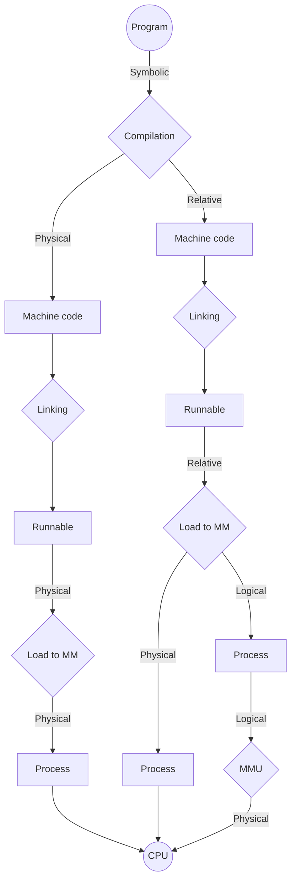

---
# Memory Addressing

[Back to index](../index.md)

---
## Types of Memory Addresses
- Symbolic
- Relative
- Logical
- Physical
> NOTE
> (CPU only works with physical addresses.)
---
## Physical Address Generation

1. **Creating a program**
	- Symbolic addresses are used (function & variable names)
	- Easier for the programmer to understand
2. **Compilation**
	- Code is transformed to machine code.
	- Symbolic addresses are usually converted to relative ones.
		- Requires to compile each individual file.
		- Relative addr. are an offset from the beginning of the file
	- Symbolic addresses can also be converted to physical ones.
		- Is not recommended.
		- Final runnable cannot be relocated.
		- Final runnable must be loaded at a specific space in MM.
3. **Linking**
	- Same memory type.
	- For relative addr. only:
		- Puts the runnable files one after another.
		- Readjusts the relative addresses (add the size of the previous files)
	- The addresses for the external functions must be assigned.
5. **Load runnable to the MM**
	- Done by the OS module called Long Term Scheduler (LTS).
	- For physical addr. the LTS loads the runnable in the specified address.
	- For relative addresses, the LTS can:
		- Load the program wherever in MM.
		- Maintain relative addr. (now logical) or convert them to physical.
7. **Run-time translation**
	- Step only required if in the previous step we keep logical addresses.
	- Done very fast by specific hardware called Memory Management Unit.

---
32