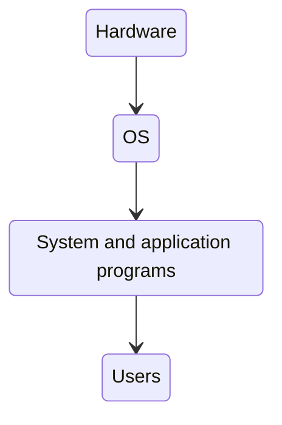

---
# Introduction to Operating Systems

[Back to index](../OS.md)

---
# Index

1. Definition of an operating system (OS).
	1. Computing system.
	2. Definition of operating system.
	3. Types of users of an operating system.
2. Historic evolution.
	1. No operating system.
	2. Batch processing (monoprogramming).
	3. Multi programmed systems.
	4. Timesharing systems.
	5. Modern operating systems.
3. Functional blocks of an operating system.
4. Booting and halting of the system.
	1. Hardware booting: the firmware.
	2. Localization of the bootloader in the BIOS.
	3. Execution of the bootloader in the BIOS.
	4. UEFI bootloaders.
	5. Execution with several devices.
	6. Types of bootloaders.
	7. OS booting.
	8. OS halting.
5. Classification of the operating systems.
	1. Regarding resource management.
	2. Regarding interactivity.
	3. Regarding the number of users.

---

## Definition of an OS

### Computing System

Formed by:
- **Hardware**.
- **Software**:
	- Application programs.
	- System programs (OS and other system programs)
- **Users**.

