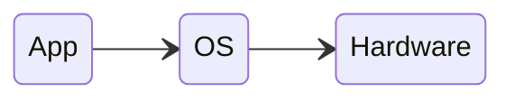

---
# Introduction

[Back to index](/Programming/CHI/CHI.md)

---

## User Interface

- Is the part of a software application responsible for communicating with the user.
- We will assume that
	- The user is always a human (not other software).
	- The interface communicates also with the Operating System (OS).
	- This OS is the one responsible of communicating with the hardware.

