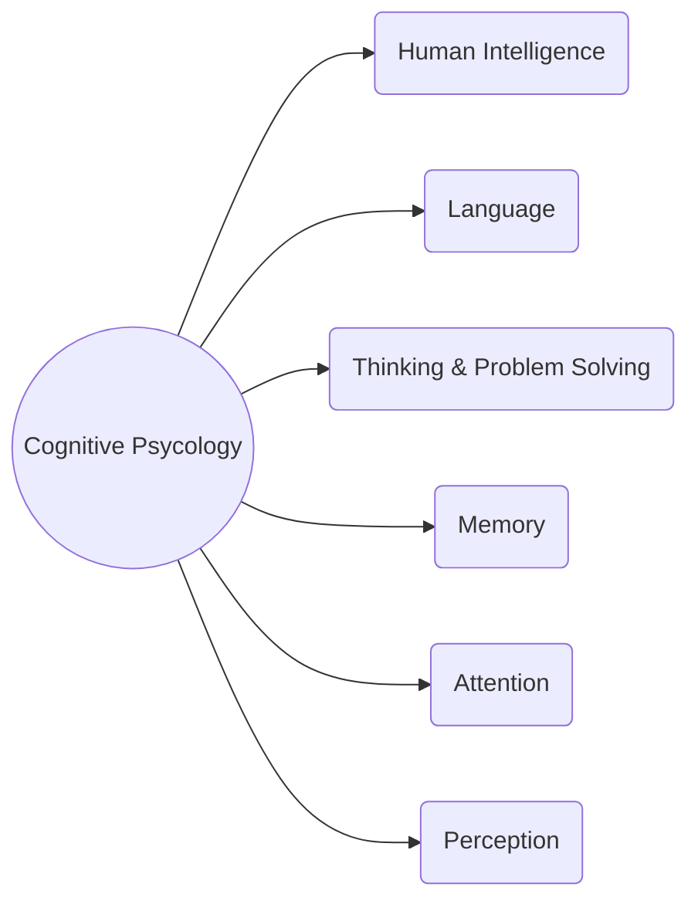

---
# Title

[Back to index](/Programming/CHI/CHI.md)

---

## User Interface Evaluation Definition

Based on cognitive psychology, we try to identify potential problems.

## Steps

First identify a usability criteria (heuristics) and then study them.
Some common heuristics are:
- System behaviour is predictable.
- System behaviour is consistent.
- Feedback is provided.