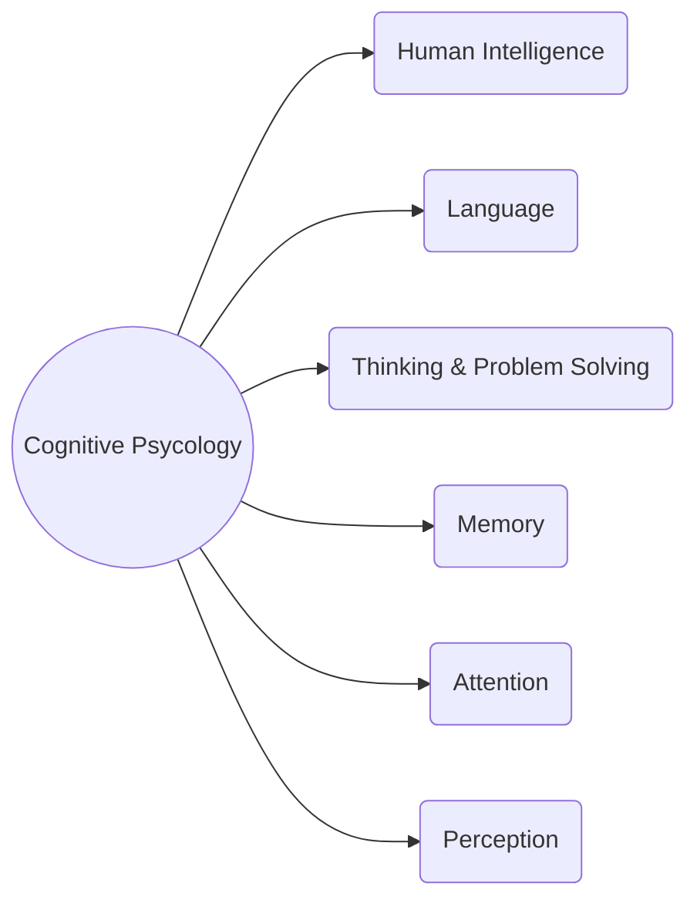

---
# GUI Evaluation

[Back to index](/Programming/CHI/CHI.md)

---

## Definition

Based on cognitive psychology, we try to identify potential problems.

First identify a usability criteria (heuristics) and then study them.
Some common heuristics are:
- System behaviour is predictable.
- System behaviour is consistent (use conventions).
- Feedback is provided.
- System uses "real world" language.
- User control and freedom (undo & redo)
- Error prevention.

A review-based evaluation relies on experimental results and empirical evidence.

## Types of Evaluation

- **Observational methods**
	- **Think aloud**. Users are asked to describe what they do and why.
	- **Cooperative evaluation**. Users and evaluator ask questions to each other.
	- Protocol analysis. Requires expert analysis of re
- Query techniques
- Physiological methods