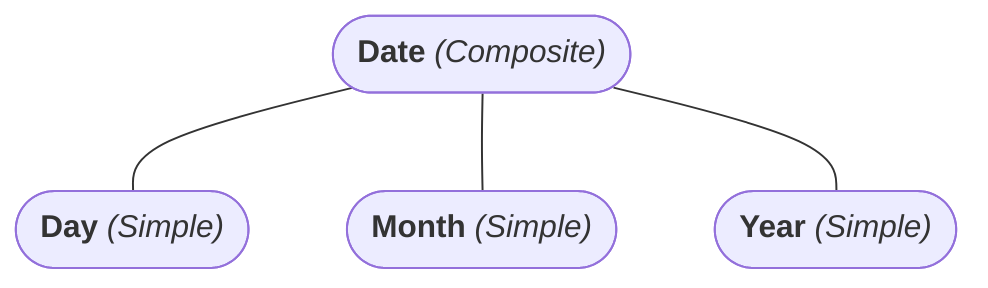

---
# Entity/Relationship Model

[Back to index](../../DATABASES.md)

---

## Entity vs Attribute

- Entries are defined by a set of attributes.

## Types of Attributes

- Simple or Composite.

- Single-valued (Simple circle) or Multi-valued (Double circle).
- Derived (Dot) or not.
- Null or not.