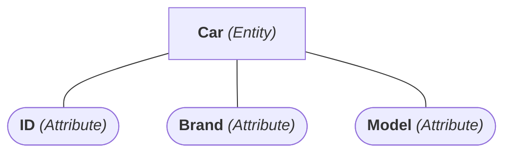
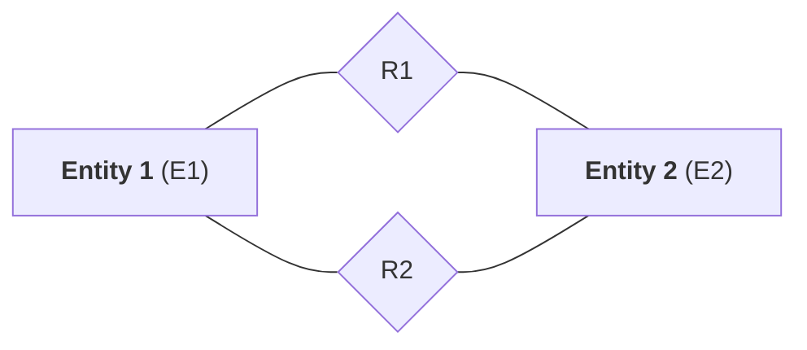

---
# Entity/Relationship Model

[Back to index](../../DATABASES.md)

---

## Entity vs Attribute

- Entries are defined by a set of attributes.

## Types of Attributes

- Simple or Composite (Formed by several simple ones).
- Single-valued (Simple circle) or Multi-valued (Double circle).
- Derived (Dotted circle) or not.
- Null or not.

## Relations

### Characteristics
- Represented with a diamond shape.
- Rol: Description
- Degree:
	- Binary (Two entity association. Common one)
	- Reflexive (Entity associated with itself)
	- N-ary (#N entity association)
- Cardinality
	- One to one (1:1)
	- One to many (1:N or N:1)
	- Many to many (N:N)
	(Specify min:max for each side)

## Keys

- Primary key - Unique, does not change.
- Foreign key - Primary key of another entity.

## Restrictions

- **Exclusivity**. E1 can participate in R1 or R2 (one at a time).
- **Exclusion**. E1 can participate in R1 and R2 but with different E2.
- **Inclusivity**. If E1 have R1 with E2, it must have R2 (with any E2).
- **Inclusion**. If E1 have R1 with E2, it must have R2 with E2 also