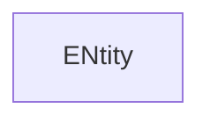

---
# Entity/Relationship Model

[Back to index](../../DATABASES.md)

---

## Entity vs Attribute

- Entries are defined by a set of attributes

```mermaid
flowchart TD
	id1[ENtity]
```
## Types of Attributes