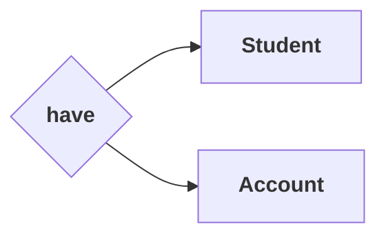
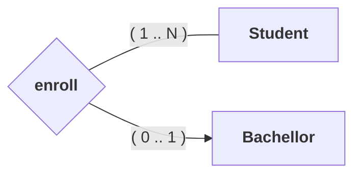
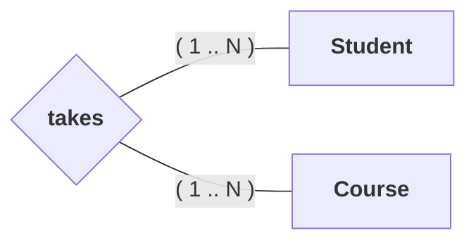

---
# Relational Model

[Back to index](../../DATABASES.md)

---

## Basic Notions

- Both attributes and relations are represented by tuples.
- Tuples are represented with parenthesis.
- Values are separated by commas.

## Attributes

- In composite attributes only appears the values that compose the attribute.
- Derived attributes are omitted.

```Relational
# Primary Keys start with @
Student = (@id, name)
Book = (@[ISBN, version], name)

# Foreign Keys must be specified
Student = (@id, idCourse (FK to Course))

#  Multi value attributes are represented apart
Course = (@id)
Places = (@[idDate, idCourse (FK to Course)], name)
```

## 1:1 Relations



```Relational
Student = (@idStudent, name)
Account = (@idAccount, info)

# Option 1
Have = (@idStudent (FK to Student), idAccount(FK to Account)(Unique))

# Option 2
Have = (@idAccount(FK to Account), idStudent (FK to Student)(Unique))
```

## 1:N Relations



```Relational
Student = (@idStudent, name)
Bachellor = (@idBachellor, description)

# Option 1
Enroll = (@idStudent (FK to Student), idBachellor(FK to Bachellor))
```

## N:N Relations



```Relational
Student = (@idStudent, name)
Bachellor = (@idBachellor, description)

Enroll = (@ [ idStudent (FK to Student), idBachellor(FK to Bachellor) ] )
```