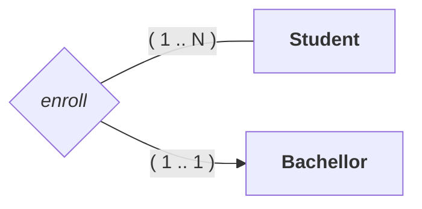
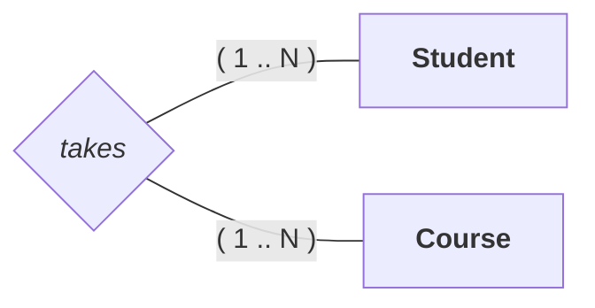
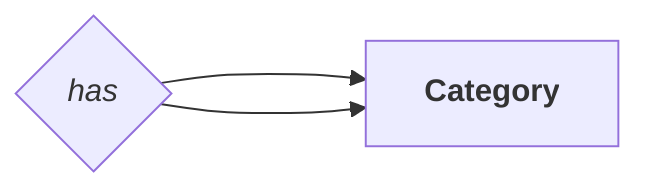
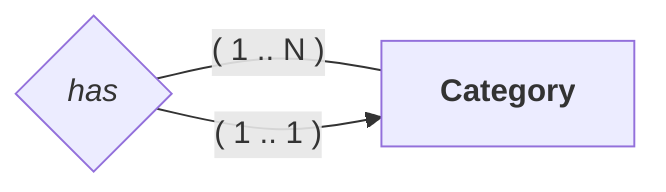
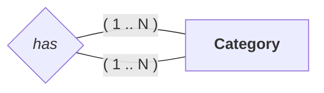
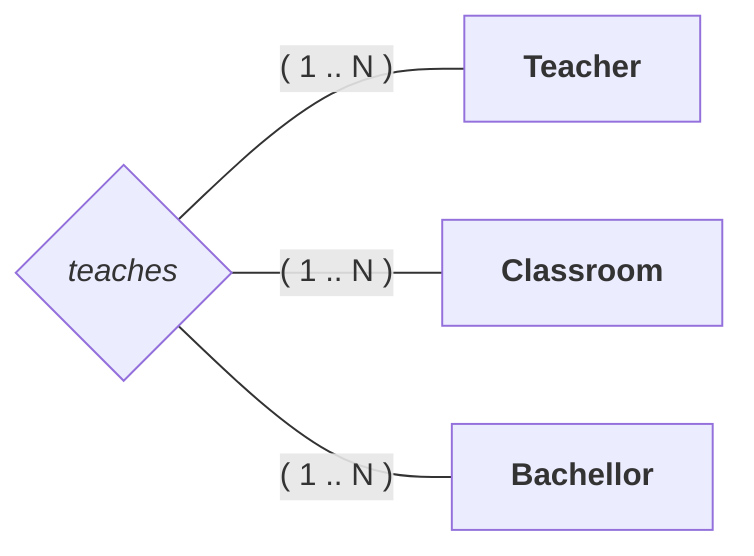
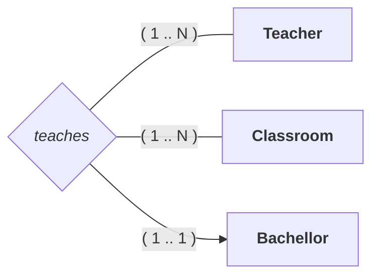

---
# Relational Model

[Back to index](../../DATABASES.md)

---

## Basic Notions

- Both attributes and relations are represented by tuples.
- Tuples are represented with parenthesis.
- Values are separated by commas.

## Attributes

- In composite attributes only appears the values that compose the attribute.
- Derived attributes are omitted.

```Relational
# Primary Keys start with @
Student = (@id, name)
Book = (@[ISBN, version], name)

# Foreign Keys must be specified
Student = (@id, idCourse (FK to Course))

#  Multi value attributes are represented apart
Course = (@id)
Places = (@[idDate, idCourse (FK to Course)], name)
```

## Relations
### 1:1 Relations


```Relational
# Option 1
Student = (@idStudent, idAccount (FK to Account) (Unique))
Account = (@idAccount)

# Option 2
Student = (@idStudent)
Account = (@idAccount, idStudent (FK to Student) (Unique))
```

### 1:N Relations



```Relational
Student = (@idStudent, idBachellor (FK to Bachellor))
Bachellor = (@idBachellor)
```

### N:N Relations



```Relational
Student = (@idStudent)
Bachellor = (@idBachellor)

Enroll = ( @[
	idStudent (FK to Student),
	idBachellor(FK to Bachellor)
])
```

### Reflexive 1:1 Relations

```Relational
Category = (@idCategory, idCategory (FK to Category) (Unique) )
```


### Reflexive 1:N Relations

```Relational
Category = (@idCategory, idCategory (FK to Category) )
```

### Reflexive N:N Relations

```Relational
Category = (@idCategory)
Has = ( @[
	idCategory (FK to Category),
	idCategory (FK to Category)
])
```

### Multidirectional N:N:N Relations

```Relational
Teacher = (@idTeacher)
Bachellor = (@idBachellor)
Classroom = (@idClassroom)

Teaches = (
	@[
		idTeacher (FK to Teacher)
		idClassroom (FK to Classroom)
		idBachellor (FK to Bachellor)
	],
)
```
### Multidirectional N:1:N Relations
- The N related are considered PK.
- The 1 related are considered just FK

```Relational
Teacher = (@idTeacher)
Bachellor = (@idBachellor)
Classroom = (@idClassroom)

Teaches = (
	@[
		idTeacher (FK to Teacher)
		idClassroom (FK to Classroom)
	],
	idBachellor (FK to Bachellor)
)
```

### Multidirectional N:1:1 Relations

```Relational
Teacher = (@idTeacher)
Bachellor = (@idBachellor)
Classroom = (@idClassroom)

Teaches = (
	@[
		idTeacher (FK to Teacher)
		idClassroom (FK to Classroom)
	] (Unique),
	idBachellor (FK to Bachellor)
)
```

## Weak entities
