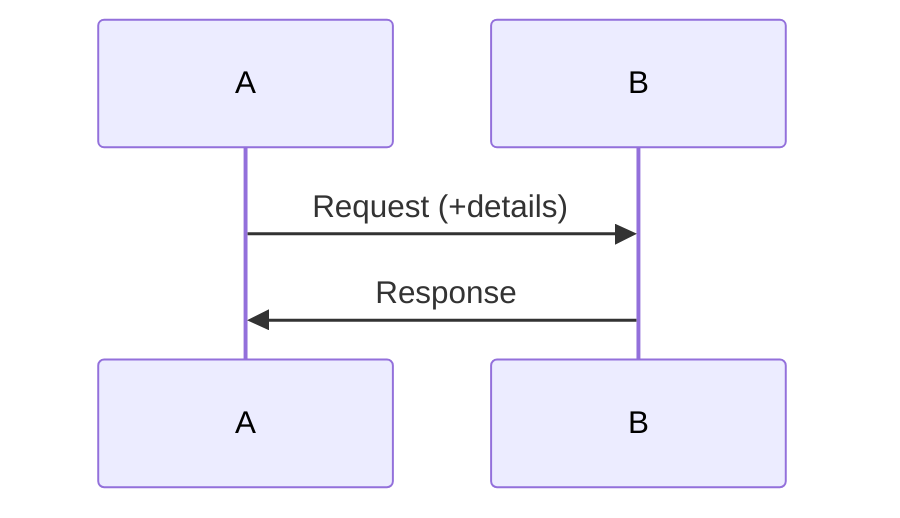
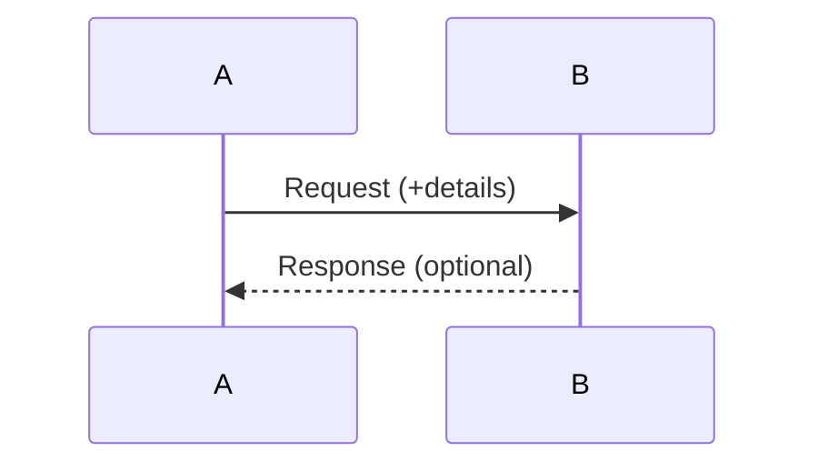

---
# Event Driven Design

[HOME](/README.md)

---
## Event Driven Programming (EDP)
### Definition
The execution flow of the program varies depending on some events.
### Program State
- The program state is difficult to determine.
- There are usually concurrent (parallel) programs.
- There are several modules:
	- Can run a different speeds.
	- Can run simultaneously.
	- Some can not necessarily run.
	- Can have several instances running.
### Events
- Events are an observable occurrence.
- Events can happen at any instant.
- Events can be external or internal.
### Event Response
- There is an observer that responds (handles) an event.
- The observer is frequently called event handler or controller.
### Event Sources
- Some events are launched by an agent.
- The agent is called event source.
---
## Event Based Systems (EBS) Interactions
### Definition
- A system is a set of agents that:
	- Change their behaviour depending on its state.
	- Interact between them in several ways (events).
- The system state is the state of all the agents at a specific time.
- A EBS is discrete if:
	- It has a finite set of states and changes.
	- Every state has a next state.
### Request-Response Interaction
- Involves only two agents.
- Response is mandatory.

### Message passing Interaction
- Involves only two agents.
- Response is optional.

### Publication-Subscription Interaction
- Involves multiple agents.
- Several B agents subscribe to A.
- Several A agents publish several types of messages.
- B agents receive messages from A agents if they are subscribed.
---
## The EDP Paradigm
### Event Model
- EDP is a paradigm whose core are the events.
- Event 