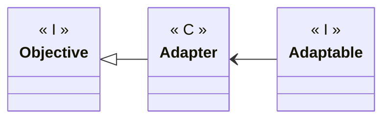

## Description

Allows the use of one or more classes as if they were of another class.

## Characteristics

- 

## UML


```mermaid
classDiagram
direction LR

Objective <|-- Adapter
Adapter <-- Adaptable

class Objective {
	<< I >>
	
}

class Adapter {
	<< C >>
}

class Adaptable {
	<< I >>
}
```
## Code

```java
public class Class { 

}
```