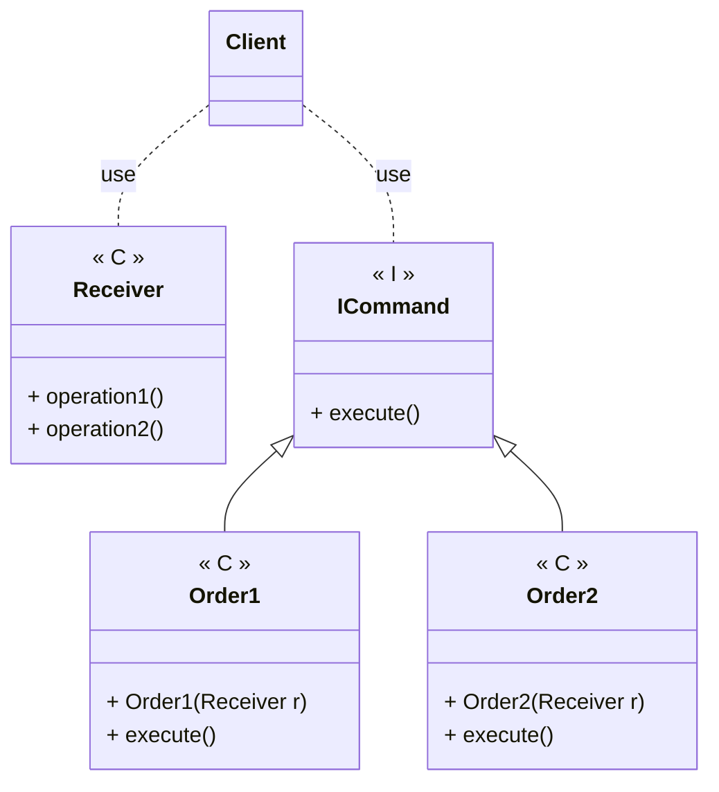

---
# Command

[Back to index](../PATTERNS.md)

---

## Description


## Characteristics

- The receiver is the object that contains all the actions.

## UML


## Code

```java
public class Client { 
	public void main(String[] args) {
		Receiver receiver = new Receiver();
	}
}
```