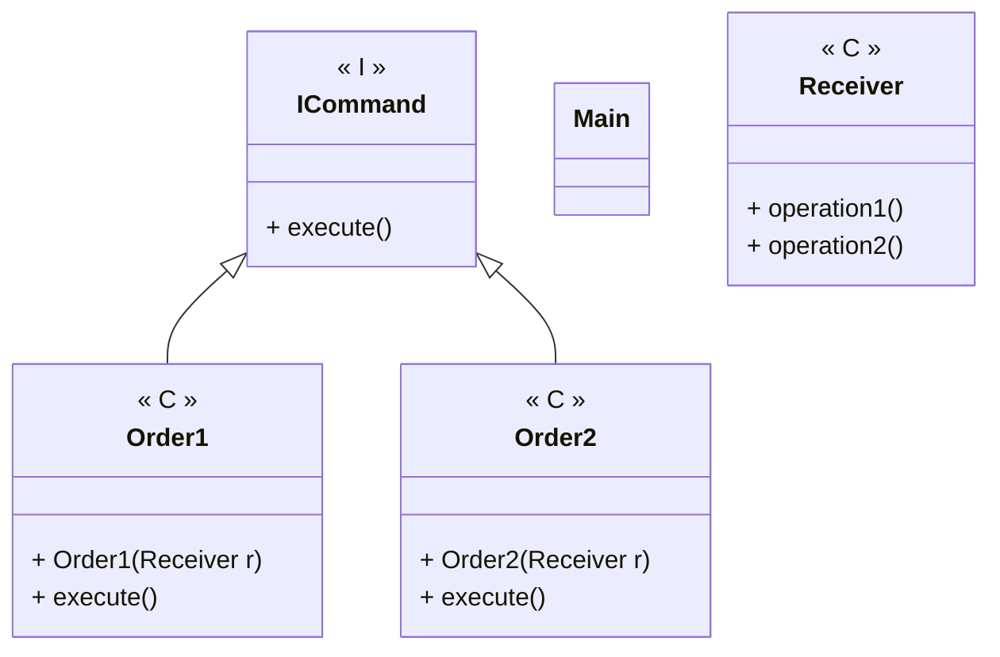

---
# Command

[Back to index](../PATTERNS.md)

---

## Description


## Characteristics

- 

## UML


```mermaid
classDiagram
direction TB

ICommand <|-- Order1
ICommand <|-- Order2

class Main {}

class Receiver {
	<< C >>
	+ operation1()
	+ operation2() 
}

class ICommand {
	<< I >>
	+ execute()
}

class Order1 {
	<< C >>
	+ Order1(Receiver r)
	+ execute()
}

class Order2 {
	<< C >>
	+ Order2(Receiver r)
	+ execute()
}

```
## Code

```java
public class Class { 

}
```