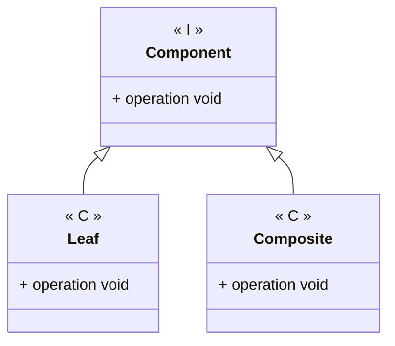

---
# Title

[Back to index](../PATTERNS.md)

---

## Description

Allows to treat groups of objects as if they were a single object.
Similar to a tree data structure.

## Characteristics

- 

## UML


## Code

```java
public class Class { 

}
```