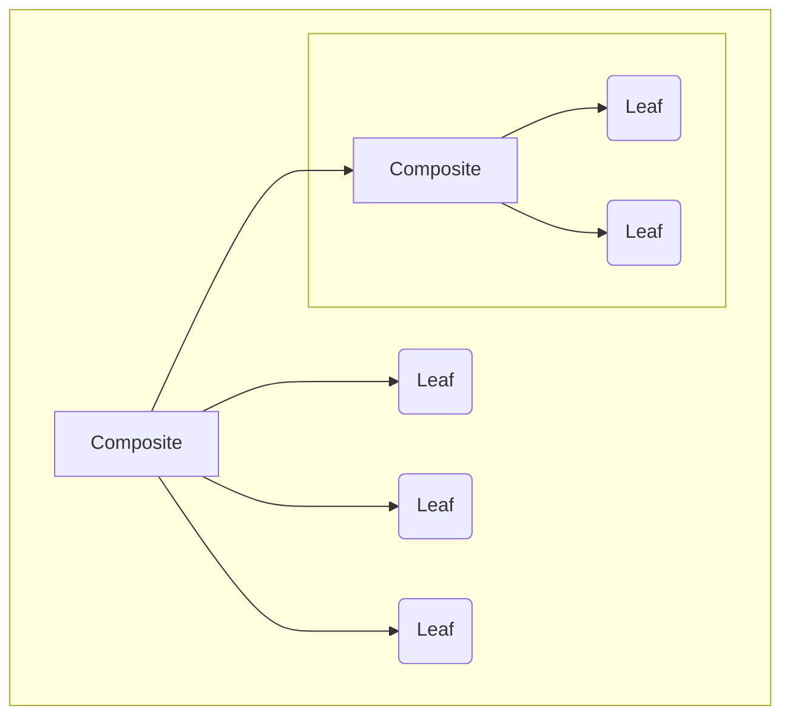
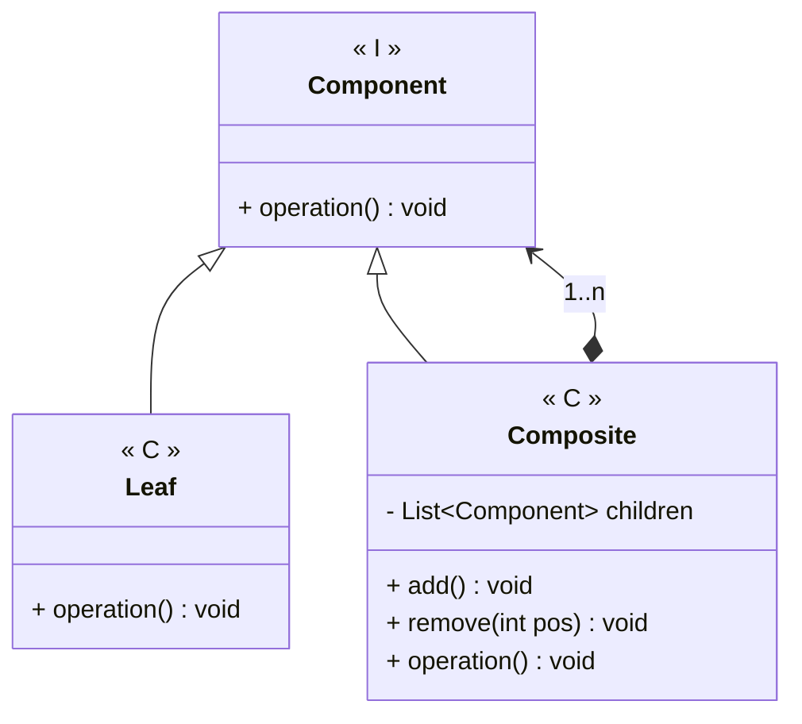

---
# Title

[Back to index](../PATTERNS.md)

---

## Description

Allows to treat groups of objects as if they were a single object.
Similar to a tree data structure.



## UML


## Code

```java
public class Component { 
	public void operation()
}
```