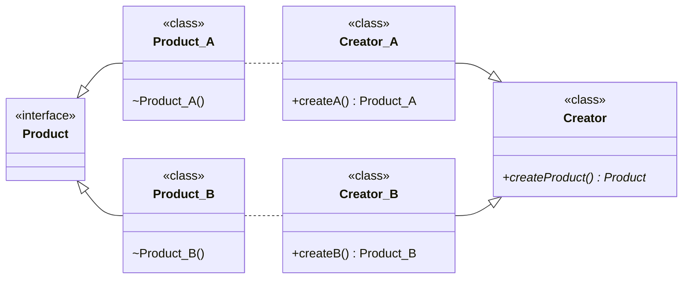

---
# Factory

[Back to index](../PATTERNS.md)

---

# Description

Encapsulates the instantiation of classes of the same type.
Use a creator class instead of direct instantiation.

> [!WARNING]
> Note that the creator class contains most of the programs logic.

# Factory Method

## Characteristics

- We have some concrete classes (products) of the same type.
- We implement a creator class
	- Contains most of the program logic.
	- Contains the **abstract** Factory Method (`createProduct()`).
	- Should have no logic **FOR CREATION**.
	- Can be abstract.
- We implement a specific creators
	- One for each concrete product.
	- Contains all the logic for that product creation.
	- Contains a specific implementation of `createProduct()`.

## UML



## Use

```java
public class Main {
	public void main(String[] args) {
		Creator creator1 = new Creator_A();
		Product product1 = creator1.createProduct();
	}
}

public class Creator {
	
}
```

# Simple Factory

## Characteristics

- Similar to Factory Method.
- Has no specific creators but a general one.

## UML

```mermaid
classDiagram
direction LR

Product_A --> Product
Product_B <|--| Product
Product .. Creator

class Product {
	<<interface>>
	+makeProduct() Product$
}

class Product_A {
	<<class>>
	~Product_A()
}

class Product_B {
	<<class>>
	~Product_B()
}

class Creator {
	<<class>>
}
```
