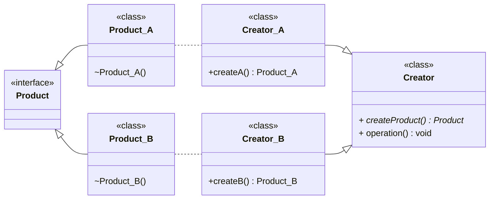
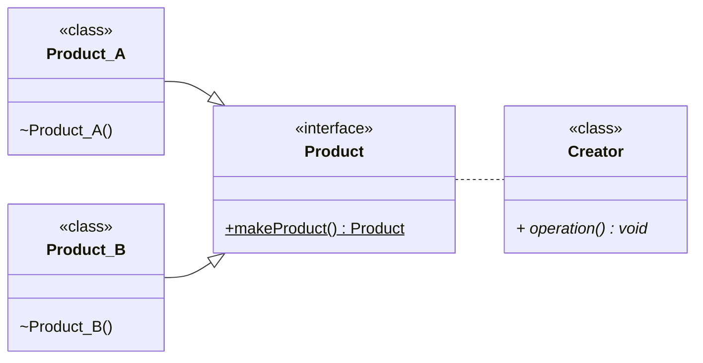

---
# Factory

[Back to index](../PATTERNS.md)

---

# Description

The objective is to encapsulate the instantiation of classes of the same type by using a creator class instead of direct instantiation.

> [!WARNING]
> Note that the creator class can contain most of the program logic.

# Factory Method

## Characteristics

- We implement a `Creator` class
	- Contains the **abstract** Factory Method (`createProduct()`).
	- Should have no logic **FOR CREATION**.
	- Can be an abstract class.
- We implement a specific creators
	- One for each concrete product.
	- Contains all the logic for that product creation.
	- Contains a specific implementation of `createProduct()`.

## UML



## Use

```java
public class Main {
	public void main(String[] args) {
		Creator cA = new Creator_A();
		
		// If we want to use the creator
		cA.operation();

		// If we want to use a product
		cA.createProduct();
	}
}

public class Creator {
	public abstract Product createProduct();
	
	public void operation() {
		Product p = createProduct();
		// Do something with p
	}
}

public class Creator_A extends Creator{
	public Product createProduct() {
		return new Product_A()
	}
}
```

# Simple Factory

## Characteristics

- Similar to Factory Method.
- Has no specific creators but a general one.

## UML



## Code

```java
abstract class Product {
	static Product makeProduct(char type) {
		switch(type)
		{
			case 'A' -> return new Product_A();
			case 'B' -> return new Product_B();
		}
	}
}

class Product_A extends Product { ... }
class Product_B extends Product { ... }

class Creator {
	public void operation() {
		Product pA = Product.CreateProduct('A');
		Product pB = Product.CreateProduct('B');
	}
}
```