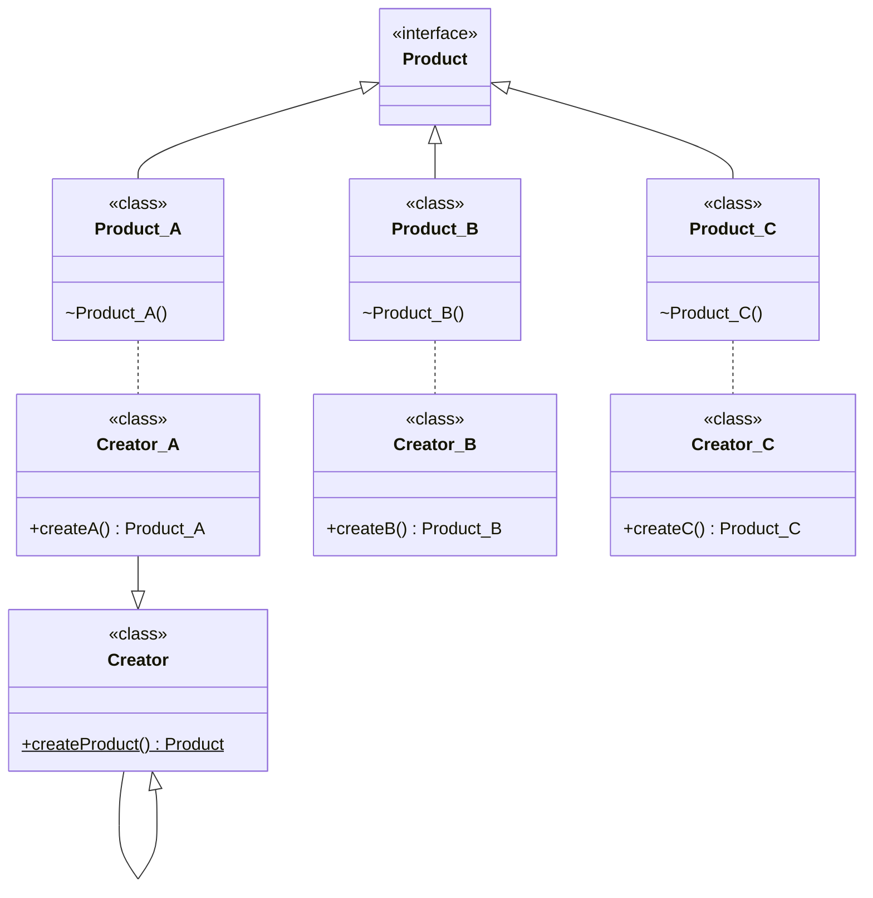

---
# Factory Method

[Back to index](../PATTERNS.md)

---

## Description

Encapsulates the instantiation of classes of the same type.
Use a method instead of direct instantiation.

## Characteristics

- We have some concrete classes (products) of the same type.
- We implement a creator class that contains the Factory Method (`createProduct()`).
- We implement a specific  

## UML



## Code

```java
public void main(String[] args) {

}
```