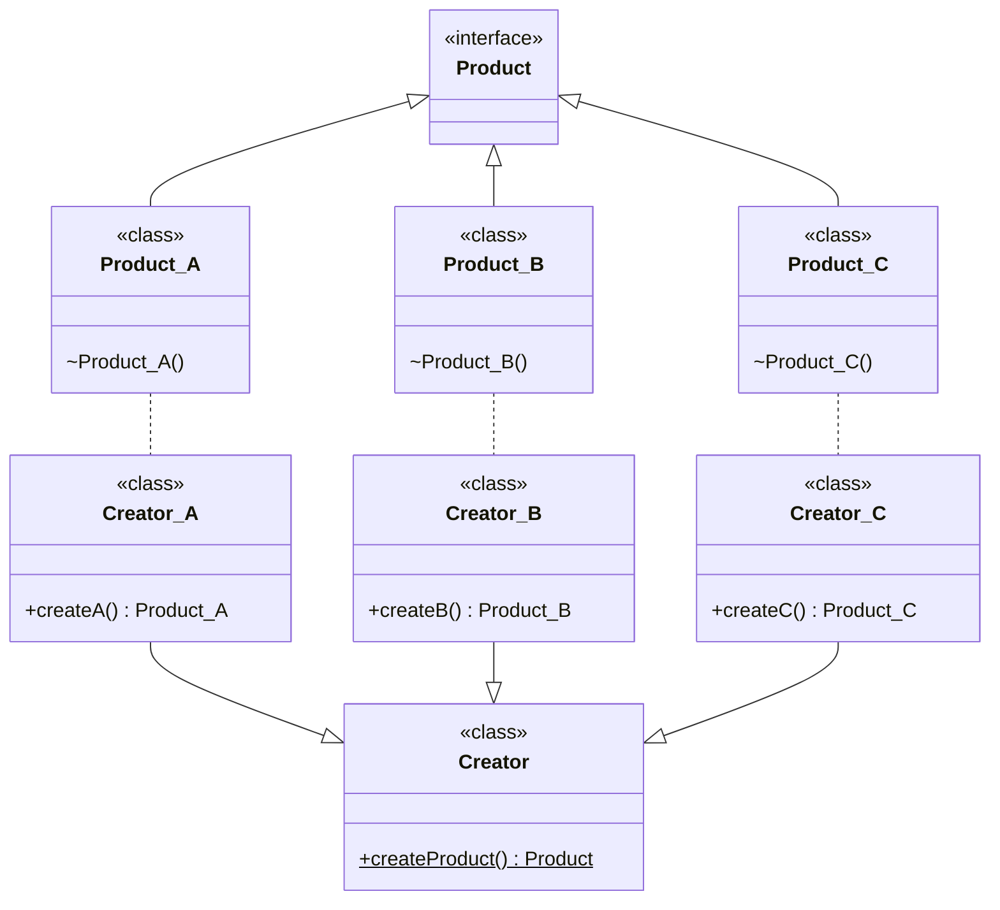

---
# Factory Method

[Back to index](../PATTERNS.md)

---

## Description

Encapsulates the instantiation of classes of the same type.
Use a method instead of direct instantiation.

## Characteristics

- We have some concrete classes (products) of the same type.
- We implement a creator class
	- Contains the **abstract** Factory Method (`createProduct()`).
	- Should have no logic. Only a structure.
	- Can be abstract.
- We implement a specific creators
	- One for each concrete product.
	- It have its specific implementation of `createProduct()`.

## UML



## Code

```java
public void main(String[] args) {

	Creator creator1 = new Creator_A();
	Product product1 = creator1.createProduct();
}
```