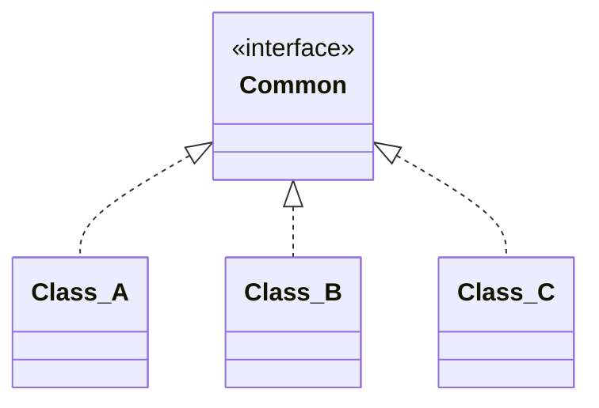

---
# Factory Method

[Back to index](../PATTERNS.md)

---

## Description

Encapsulates the instantiation of classes of the same type.
Use a method instead of direct instantiation.

## Characteristics

- 

## UML


## Code

```java
public class Class { 
 
}
```