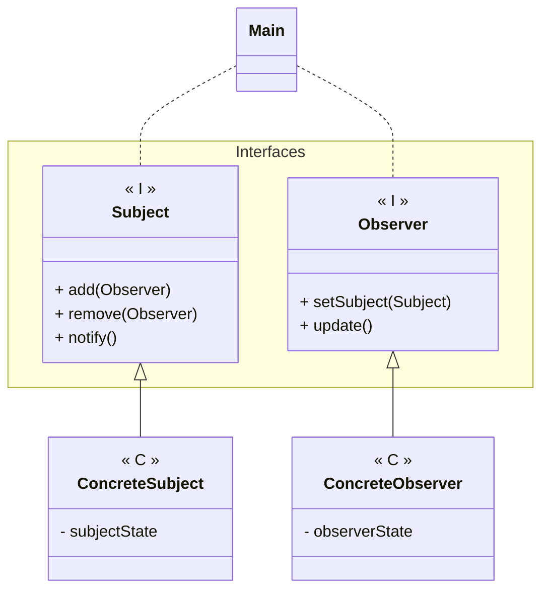

---
# Observer

[Back to index](../PATTERNS.md)

---

## Description

Allows to modify several objects (Observers) based on changes in other object (subject).

## Characteristics

- Subject notifies Observers when there is a change.
- Notified Observers change accordingly to its associated Subject

## UML


## Code

```java
public class ConcreteSubject { 

}
```