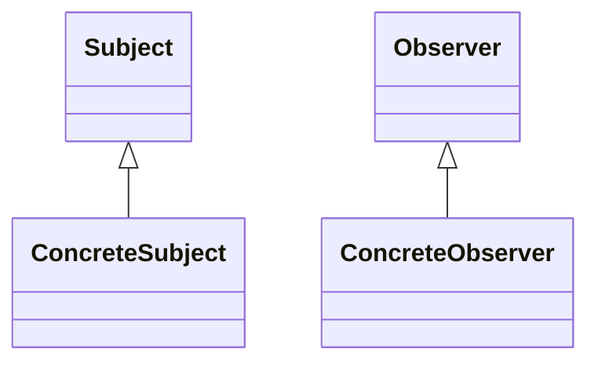

---
# Observer

[Back to index](../PATTERNS.md)

---

## Description

Allows to modify several objects (Observers) based on changes in other object (subject).

## Characteristics

- 

## UML


## Code

```java
public class Class { 

}
```