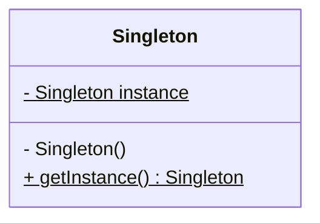

---
# Singleton

[Back to index](../PATTERNS.md)

---

## Description

Guaranties only one instance of a class and provide global access to it.

## Characteristics

- Static variable: `instance`.
- Private constructor.
- Static function `getInstance()`

## UML


## Code

```java
public class Singleton { 

	private Singleton() { ... }
	
	private static Singleton instance = null;
	
	public static Singleton getInstance() {
		if (instance == null)
			instance = new Singleton();
		return instance;
	}
}
```