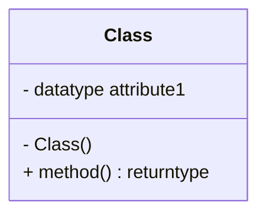

---
# State

[Back to index](../PATTERNS.md)

---

## Description

Allows to modify the behaviour 

## Characteristics

- 

## UML


```mermaid
classDiagram
class Class {
	- datatype attribute1
	- Class()
	+ method() returntype
}
```
## Code

```java
public class Class { 

}
```