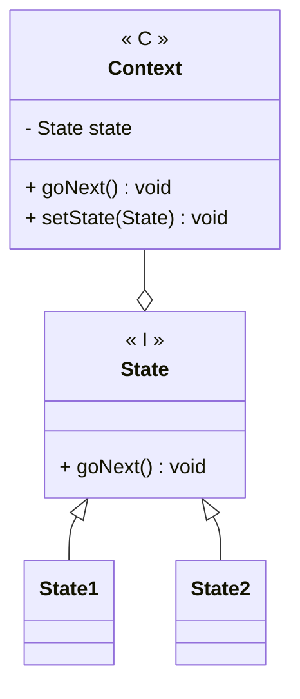

---
# State

[Back to index](../PATTERNS.md)

---

## Description

Allows to modify the behaviour of an object depending on a internal state.

## Characteristics

- 

## UML


## Code

```java
public class Class { 

}
```