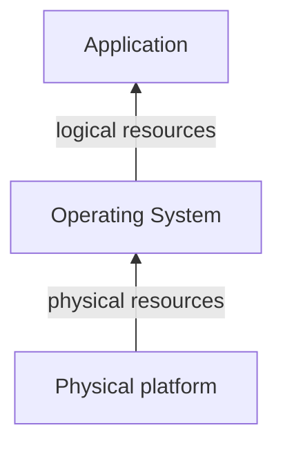

# Virtualization technologies
---
[Go Back](UNIOVI/3S2_IntSys/README.md)

---
## Introduction
- Computer systems present a layered structure:

- Virtualization = **modified view** of resources that one layer provides to its upper layer
- We consider a new layer in between called the **virtualization layer**.
---
## Resource virtualization
- Modified view of a physical resource
- Virtualization layer can be:
	- In the **Physical Platform** (By hardware)
		- Disk virtualization through a physical RAID controller
		- Virtualization layer in the controller firmware
	- In the **Operating System** (By software)
		- Main memory virtualization through the virtual memory
		- Virtualization layer in the OS memory management subsystem
---
## Platform virtualization
- Mechanism for generating virtual execution platforms
- To avoid OS modification, they adapt to virtual platforms through drivers
- Now a single server hosts multiple servers
- Method to void server proliferation (are expensive and have low utilization)
### Type 1 - Native or Bare-metal
- Virtualization layer directly on top of the physical platform
- Two types:
	- **Micro-kernel architecture**
		- It is a minimal kernel that manages processor, memory and interruptions.
		- There is a privileged machine that:
			- Manages I/O operations.
				- Every VM has a front driver that manages the virtual I/O operations.
				- Priviledged VM has:
					- A native driver that manages the real I/O operations.
					- A rear driver that connects every VM front driver to the native one.
			- Manages VMs with a management tool.
		- Examples. Xen (1MB) or Hyper-V
	- **Monolithic kernel architecture**
		- The kernel is small and manages processor, memory, interruptions and I/O.
		- Primary used for server virtualization.
		- To manage the VMs:
			- An external machine with an administrative tool is required.
			- A process controls the connection through the network
		- Examples. VMWare ESXi (32MB)

---
## Operating system virtualization

---
## Application virtualization

---