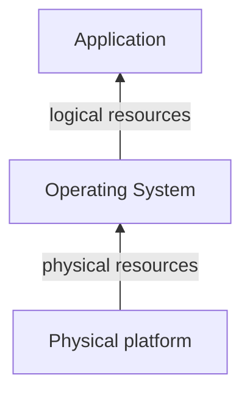

# Virtualization technologies
---
[Go Back](UNIOVI/3S2_IntSys/README.md)

---
## Introduction
- Computer systems present a layered structure:

- Virtualization = **modified view** of resources that one layer provides to its upper layer
- We consider a new layer in between called the **virtualization layer**.
---
## Resource virtualization
- Modified view of a physical resource
- Virtualization layer can be:
	- In the **Physical Platform** (By hardware)
		- Disk virtualization through a physical RAID controller
		- Virtualization layer in the controller firmware
	- In the **Operating System** (By software)
		- Main memory virtualization through the virtual memory
		- Virtualization layer in the OS memory management subsystem
---
## Platform virtualization
- Mechanism for generating virtual execution platforms
- To avoid OS modification, they adapt to virtual platforms through drivers
- Objectives
	- Avoid server proliferation (low utilization, acqu)
### Type 1

---
## Operating system virtualization

---
## Application virtualization

---