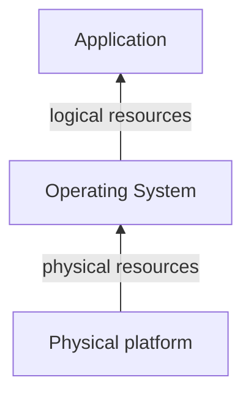

# Virtualization technologies
---
[Go Back](UNIOVI/3S2_IntSys/README.md)

---
## Introduction
- Computer systems present a layered structure:

- Virtualization = modified view of resources that one layer provides to its upper layer
- We consider a new layer called the 