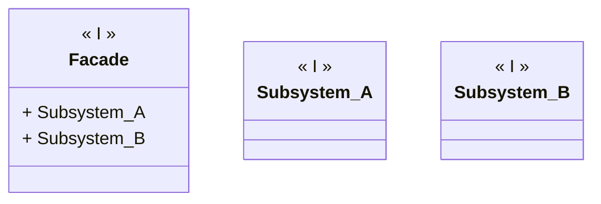

---
# Title

[Back to index](../PATTERNS.md)

---
## Description

Provides a unified interface to facilitate the use of one or more subsystems.

## UML


## Code

```java
public class Class { 

}
```